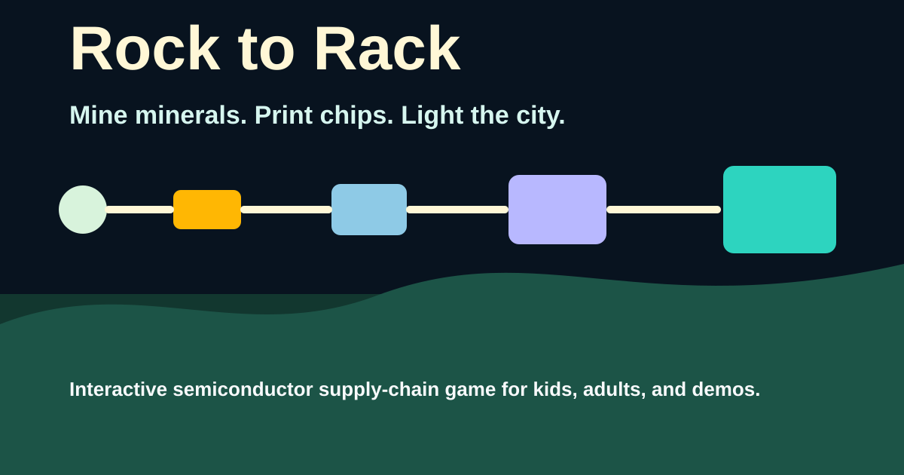

# Rock to Rack

Rock to Rack is a browser game about the semiconductor supply chain. Players mine minerals, refine silicon, grow wafers, print circuits, package chips, and power a data center while trying to bring a public-interest AI workload online.



## Play

- Live build: `https://rock-to-rack.vercel.app`
- Fast challenge: `/` or `/?reset#crisis`
- Guided campaign: `/#menu`

The game is designed for a quick demo path and a fuller six-chapter learning path. It runs in a modern browser and saves progress locally.

## Game Modes

- Crisis Run: a timed rescue challenge where players balance racks, power, cooling, chips, and city lights.
- Learn the Chain: a six-chapter campaign that follows the path from raw minerals to a running data center.
- Kid and Nerd text modes: simplified or more technical wording for different audiences.

## Supply Chain Covered

```text
Mine -> Refine -> Grow -> Fab -> Package -> Power
```

The chapters cover mining, refining, crystal growth and wafer slicing, fabrication, packaging/binning, and data-center deployment.

## Demo Routes

- Crisis Run front door: `/` or `/?reset#crisis`
- Main menu: `/#menu`
- Chapter 1: `/?reset#ch1`
- Chapter 4 fab demo: `/?reset#ch4`
- Chapter 6 data-center finale: `/?reset#ch6`
- Debug overlay: `/?reset&debug=1#ch6`

## Local Development

```bash
corepack pnpm install
corepack pnpm dev
corepack pnpm test
corepack pnpm simulate
corepack pnpm build
```

## Documentation

- User manual: `docs/USER_MANUAL.md`
- Agent context: `docs/agent-context.md`
- Cold playtest script: `docs/playtests/2026-07-09-cold-playtest-script.md`
- Cold playtest notes template: `docs/playtests/2026-07-09-cold-playtest-notes-template.md`
- Award submission checklist: `docs/submission/2026-07-09-award-submission-checklist.md`

## Ship Checks

```bash
corepack pnpm test
corepack pnpm simulate
corepack pnpm build
corepack pnpm verify:static
```

In a second terminal, serve the production build:

```bash
corepack pnpm preview --host 127.0.0.1
```

Then run the browser checks against `http://127.0.0.1:4173/`:

```bash
corepack pnpm smoke:m10
corepack pnpm smoke:m11
corepack pnpm smoke:m12
corepack pnpm perf:m10
```

Run `perf:m10` by itself, not in parallel with the browser smokes, so
first-playable timing is not distorted by local contention.

The browser smoke scripts keep running even if Firefox or WebKit are not
installed. When those binaries are missing, the scripts report them as
unavailable instead of making installation a hidden prerequisite for the
normal local ship path.

## Public Pitch

10 minutes, kids to CTOs, browser tab. Players feel the tradeoffs behind chips: resource constraints, yield, binning, heat, power, and data-center demand.

## Feedback

Feedback plumbing is implemented but hidden until `SITE_METADATA.feedbackHref` is configured with a real mailto or form URL.

## Cold Playtests

Use `docs/playtests/2026-07-09-cold-playtest-script.md` for the human-run
3-5 player pass before award submission. Keep tester names, contact details,
and recordings out of the repo unless they are explicitly anonymized.
Use `docs/playtests/2026-07-09-cold-playtest-notes-template.md` for private,
anonymous observer notes.

## Award Submission

Use `docs/submission/2026-07-09-award-submission-checklist.md` as the manual
gate before any award submission. Agents may prepare evidence and copy, but
Umar performs any production promotion or submission.

## Deployment

Build output lives in `dist/`. Vercel preview deploy is the default shipping target. Production promotion requires explicit human approval.

## License

All rights reserved. See `LICENSE`. The repository is publicly viewable, but no reuse, redistribution, or modification rights are granted.
